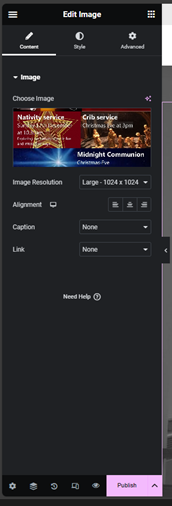
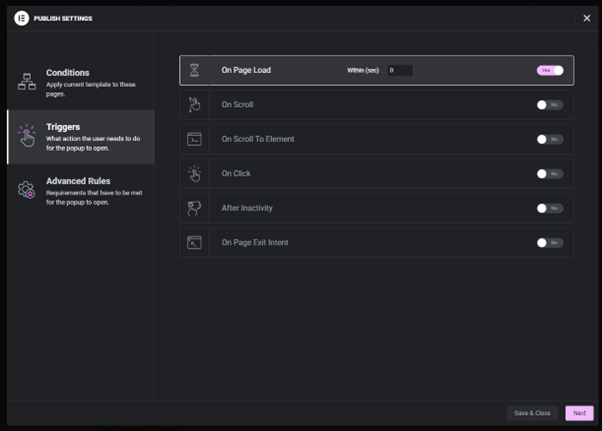

# Keresley Archives
## Magazine Introduction
The magazines archive utilises the Wordpress posts feature. There are 3 parts to uploading a magazine to the website:
1. [Uploading a Magazine to Real3D Flipbook](## Uploading a Magazine)
2. [Creating a WordPress post for the magazine](## Creating a WordPress Post)
3. [Adding the link to the magazines table](## Updating the Magazine Table)

## Uploading a Magazine

## Creating a WordPress Post
Go to [https://www.keresley.church/wp-admin/edit.php](https://www.keresley.church/wp-admin/edit.php) and click on Add a New Post

Give the post a title, click save draft and then click on Edit in Elementor

You will then be taken to the Elementor editor for final creation of the post.

In the sidebar search for Real3D Flipbook and drag it to the centre of the page.

Once the flipbook has been added to the page. Use the sidebar to select the correct flipbook to display.

## Updating the Magazine Table
Go to https://www.keresley.church/wp-admin/edit.php?post_type=elementor_library&tabs_group=popup&elementor_library_type=popup

Under “Advent” click on Edit with Elementor

In the Elementor page editor, click on last years poster and the sidebar of the left will update.

Click on the image preview and upload the new poster and select that. Once you have done that the image has been updated so you can click on Update on the sidebar.
Next to update click on the up arrow and then Triggers

Turn page load on or off then click save and close.

In advanced rules, you can set it to auto turn on and off, the option is under schedule date and time.
