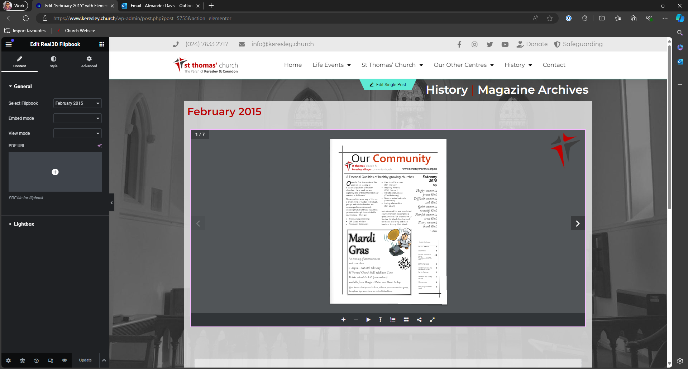

# Keresley Archives
## Magazine Introduction
The magazines archive utilises the Wordpress posts feature. There are 3 parts to uploading a magazine to the website:
1. [Uploading a Magazine to Real3D Flipbook](#uploading-a-magazine)
2. [Creating a WordPress post for the magazine](#creating-a-wordpress-post)
3. [Adding the link to the magazines table](#updating-the-magazine-table)

## Uploading a Magazine
Coming Soon

## Creating a WordPress Post
Go to [https://www.keresley.church/wp-admin/edit.php](https://www.keresley.church/wp-admin/edit.php) and click on Add a New Post

Give the post a title, click save draft and then click on Edit in Elementor

You will then be taken to the Elementor editor for final creation of the post.

In the sidebar search for Real3D Flipbook and drag it to the centre of the page.

Once the flipbook has been added to the page. Use the sidebar to select the correct flipbook to display.

## Updating the Magazine Table
Coming Soon