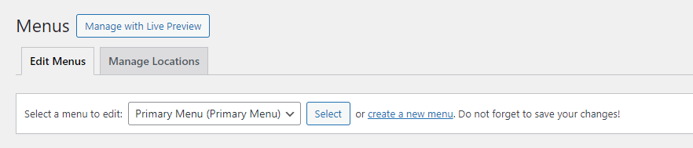
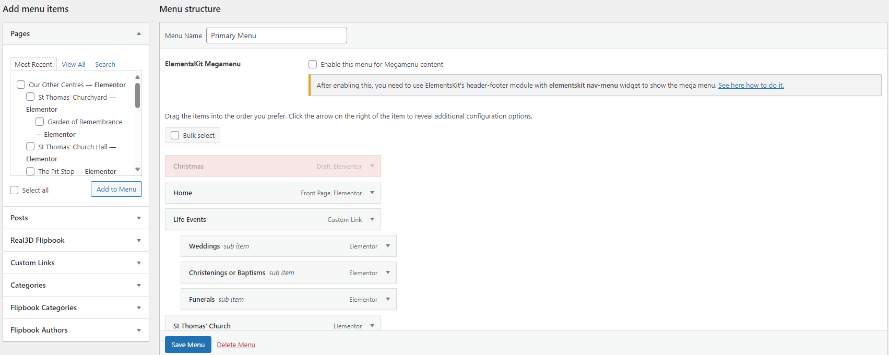

# Creating Web Pages
## Creating a new page

Go to the [https://www.keresley.church/wp-admin/edit.php?post_type=page](WordPress Pages Page) and click "Add New Page" 

In the Elementor page editor, click on last years poster and the sidebar of the left will update. 

Enter the name of the page you want to create then click on Edit with Elementor

This will show you the main Elementor page editor.

Select the items you want on the page and drag them from the sidebar to the page. Once you have added the content for your new page, click on Publish.

## Adding a page to the main menu

Go to https://www.keresley.church/wp-admin/nav-menus.php

Make sure the menu you are editing is Primary Menu. This can be changed at the top of the page.

In the left panel, tick the box next to the page you want to add then click on "Add to Menu". This will add the page to the end of the menu (after the contact page). To move the item around, click and drag it to where you want it to go. You can nest items as sub-items with this tool.

Make sure to click Save Menu when you are done.

==Menu updates may take 30-60 minutes to show on devices==