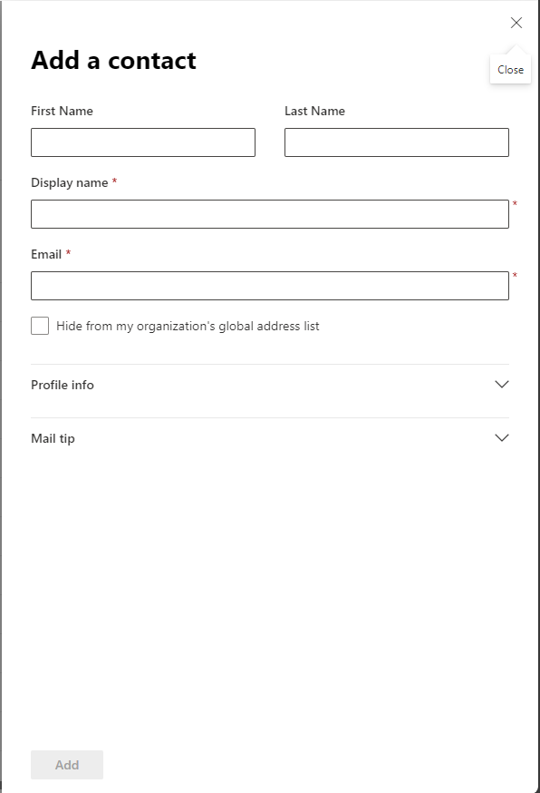
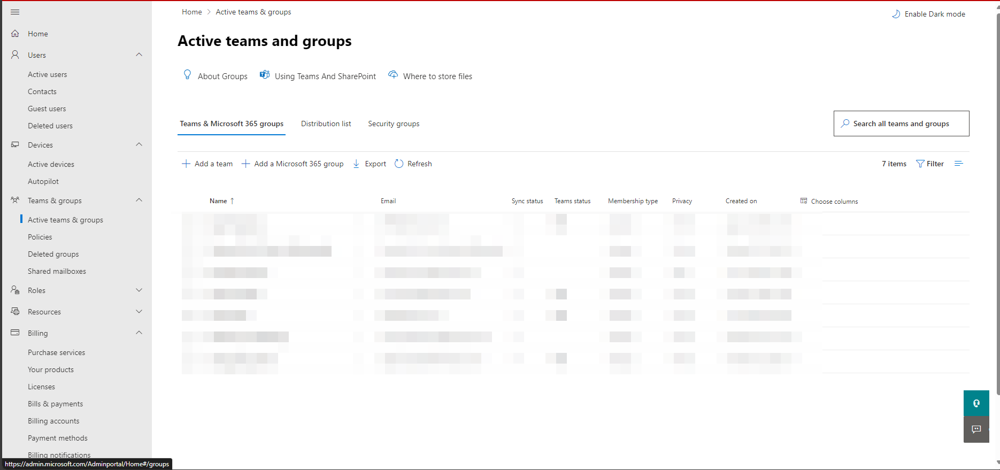
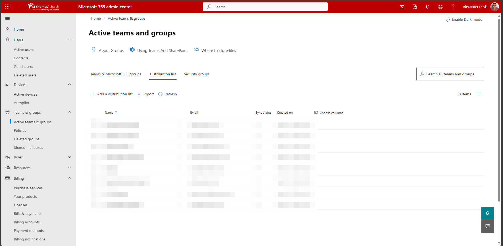
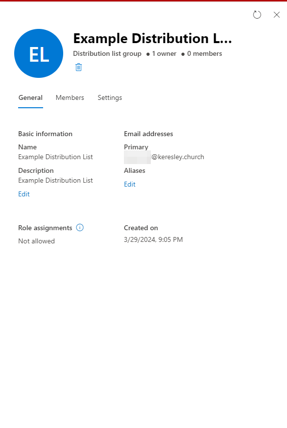
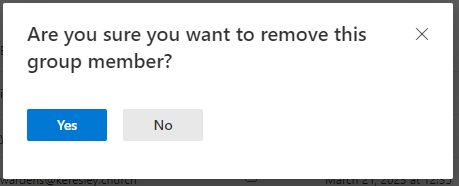

# Distribution Lists
## Adding a Contact

Go to the [Microsoft 365 Admin Centre](https://admin.microsoft.com/Adminportal/Home#/homepage) and under Users select Contacts

This will show you all contacts and their details we hold for them on Microsoft 365.

Click Add a Contact

Enter the details for this new contact then click on Add at the bottom of the form.

## Creating a Distribution List

Go to the [Microsoft 365 Admin Centre](https://admin.microsoft.com/Adminportal/Home#/homepage) and under Teams & Groups select Active Teams & Groups

Select Distribuion lists

Select Add a Distribution List. Enter a name for this new list and click next.

On the next screen, click Add Owners and add the users who will be able to manage the list. ==You must include Online Services as one of the owners==

Click next again, this will take you to the members screen. Click Add Members and select all the users and contacts that should receive emails from this distribution list.

Click next again and enter the email address you wish to use for the distribution list. You can select whether users without a @keresley.church account can email this distribution list.

Click next and review the information and settings you have selected. If all the details are correct, click Create Group.

## Updating Distribution Lists
### Adding Someone to a Distribution List

Go to the [Microsoft 365 Admin Centre](https://admin.microsoft.com/Adminportal/Home#/homepage) and under Teams & Groups select Active Teams & Groups

Select Distribuion lists

Select the list you want to add the person to, this will display a screen similar to the one below.

Click on Members then View all and manage members

Click on add members then tick the box next to the user or contact you wish to add to the list then click Add.

### Removing Someone from a Distribution List

Go to the [Microsoft 365 Admin Centre](https://admin.microsoft.com/Adminportal/Home#/homepage) and under Teams & Groups select Active Teams & Groups

Select Distribuion lists

Select the list you want to add the person to, this will display a screen similar to the one below.

Click on Members then View all and manage members

Tick the box next to the contact you want to remove then click the three dots to the right of the search members box and click on Remove Members.

This will display a confirmation box. Click yes or no and this will remove them and save the distribution list.

