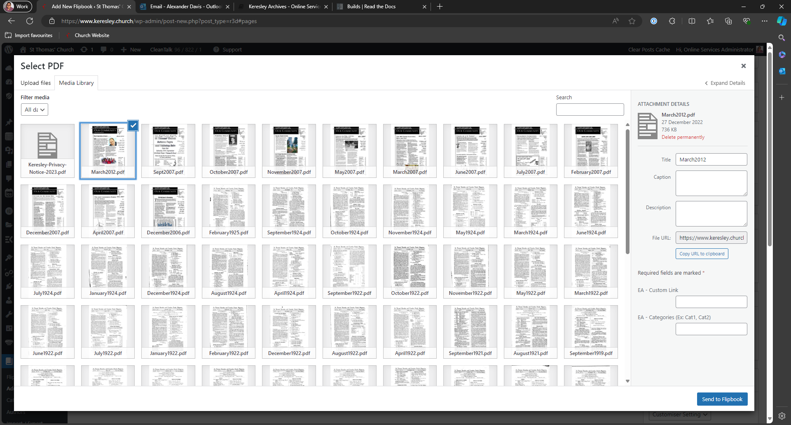
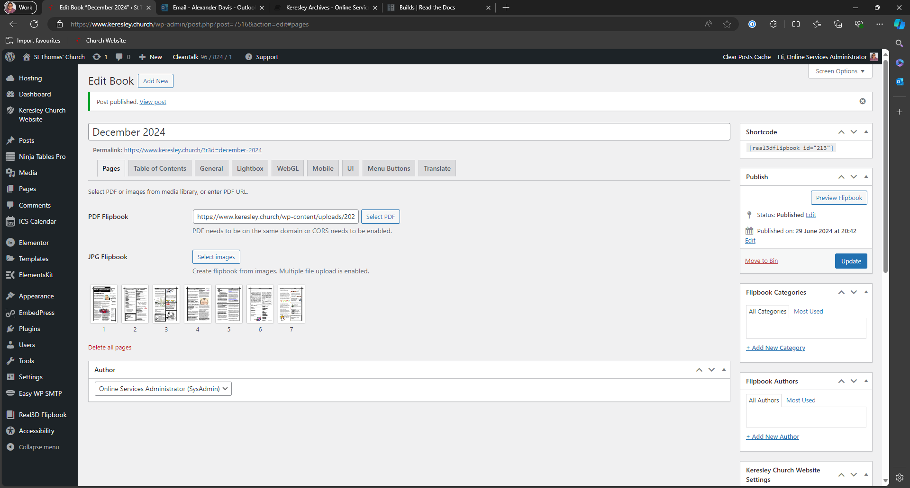
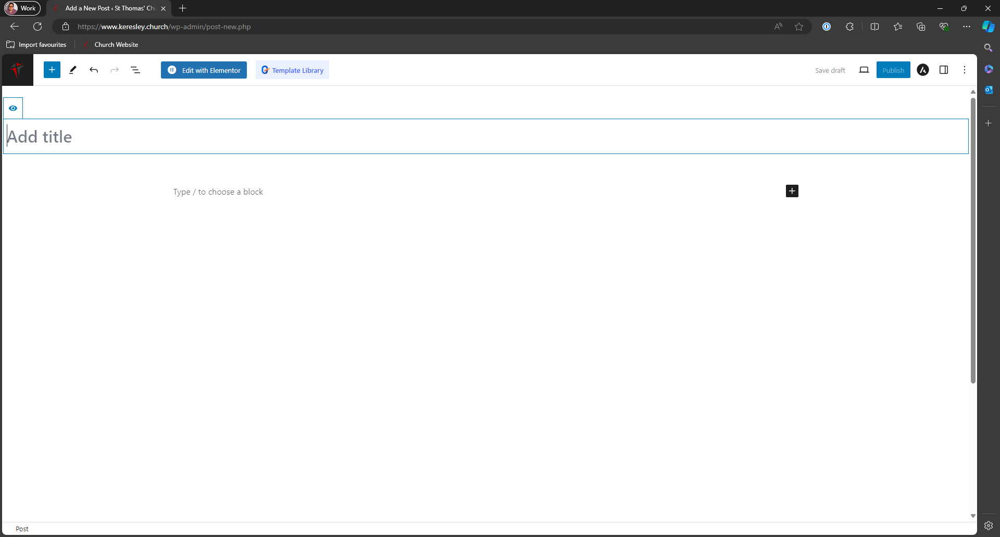
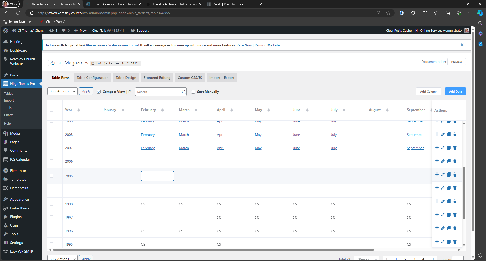

# Keresley Archives
## Magazine Introduction
The magazines archive utilises the Wordpress posts feature. There are 3 parts to uploading a magazine to the website:

1. [Uploading a Magazine to Real3D Flipbook](#uploading-a-magazine)

2. [Creating a WordPress post for the magazine](#creating-a-wordpress-post)

3. [Adding the link to the magazines table](#updating-the-magazine-table)

## Uploading a Magazine
Once logged into WordPresss, go to [https://www.keresley.church/wp-admin/edit.php?post_type=r3d](https://www.keresley.church/wp-admin/edit.php?post_type=r3d) and click on Add New.

Type in the name of the magazine you are uploading then click on Select PDF.

Drag the file of the PDF you wish to upload and make sure it has been selected before clicking on Send to Flipbook.

Finally click Publish.

## Creating a WordPress Post
Go to [https://www.keresley.church/wp-admin/edit.php](https://www.keresley.church/wp-admin/edit.php) and click on Add a New Post

Give the post a title, click save draft and then click on Edit in Elementor

You will then be taken to the Elementor editor for final creation of the post.

In the sidebar search for Real3D Flipbook and drag it to the centre of the page.

Once the flipbook has been added to the page. Use the sidebar to select the correct flipbook to display.

## Updating the Magazine Table
In this example, we are adding an entry for a year that doesn't exist (January 2005).

Go to [https://www.keresley.church/wp-admin/admin.php?page=ninja_tables#/tables/4882/](https://www.keresley.church/wp-admin/admin.php?page=ninja_tables#/tables/4882/) and find the year/month you want to add an entry to.

As the year does not exist, click on the plus icon at the end of the row containing the year after your magazine entry

 This example is adding an entry for 2005. Untick the box next to continue adding then click Add.
 

 You will see the table updated. Click the column which contains the month you want to add an entry to
 

We now have to put some HTML code in, this is the only way we can update the table for now. Go to your new post that you created in the previous section of this guide. Use the code below as your template. The section in speech marks MUST be replaced with the address of the new WordPress post you created.
`<a href="http://www.keresley.church/magazine/february-2007/">February</a>`

As soon as you click off the field, the table will automatically save and update.
