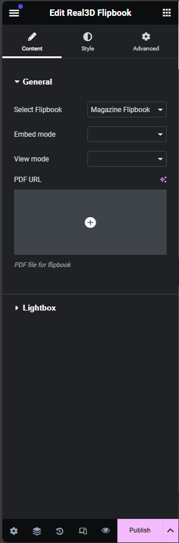
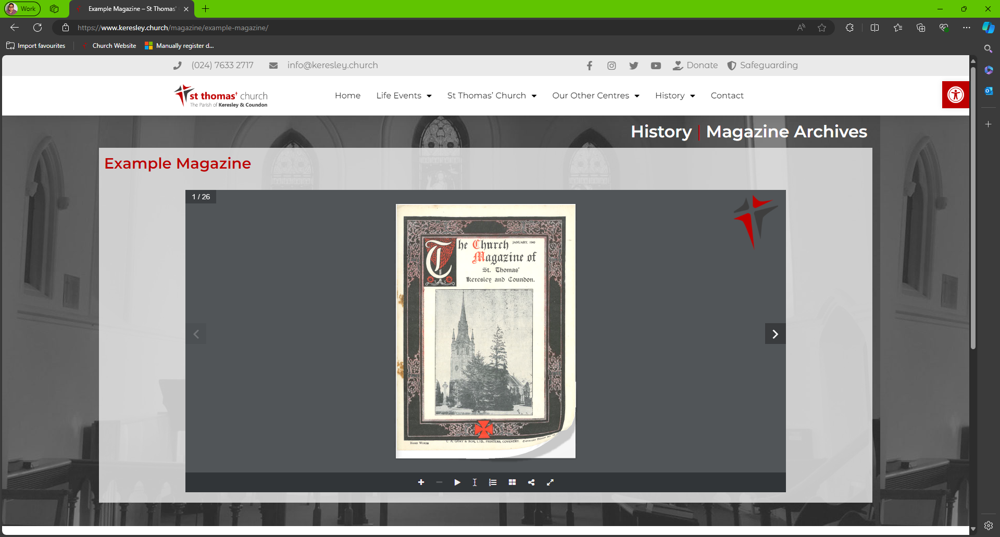
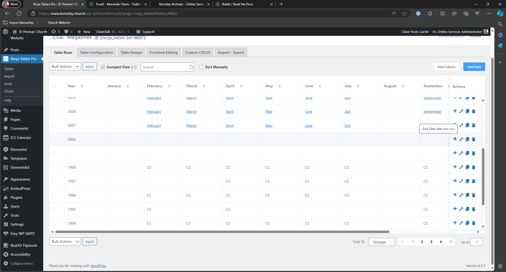
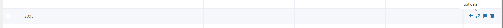

# Keresley Archives
## Magazine Introduction
The magazines archive utilises the Wordpress posts feature. There are 2 parts to uploading a magazine to the website:
1. [Creating a WordPress post for the magazine](#creating-a-wordpress-post)

2. [Adding the link to the magazines table](#updating-the-magazine-table)

## Creating a WordPress Post
Go to [https://www.keresley.church/wp-admin/edit.php](https://www.keresley.church/wp-admin/edit.php) and click on Add a New Post

Give the post a title, click save draft and then click on Edit in Elementor
> ### Important Information
> The name of the post should be MONTH YEAR only. e.g. February 2025
> Adding additional words to the title causes issues with the website search system.

You will then be taken to the Elementor editor for final creation of the post.

In the sidebar search for Real3D Flipbook and drag it to the centre of the page.

Once the flipbook has been added to the page. Use the sidebar to select the "Magazine Flipbook".

Once this has been selected, click on the plus icon under PDF URL. This will open the media browser. Drag and drop the file into this browser and click Select.

Once done, click on Publish

When the publish post confirmation has appeared, click on take a look. This will take you to the live page. Make a note of the address for this page.

## Updating the Magazine Table
In this example, we are adding an entry for a year that doesn't exist (January 2005).

Go to [https://www.keresley.church/wp-admin/admin.php?page=ninja_tables#/tables/7694/](https://www.keresley.church/wp-admin/admin.php?page=ninja_tables#/tables/7694/) and find the year/month you want to add an entry to.

As the year does not exist, click on the plus icon at the end of the row containing the year after your magazine entry

 This example is adding an entry for 2005. Untick the box next to continue adding then click Add.
 

 You will see the table updated. At the end of the row for the correct year, click on the pencil to edit the data.
 

Paste the link for the new magaine post in the correct month then click Update at the bottom of the page.

As soon as you click update, the table will automatically save and update the public page.